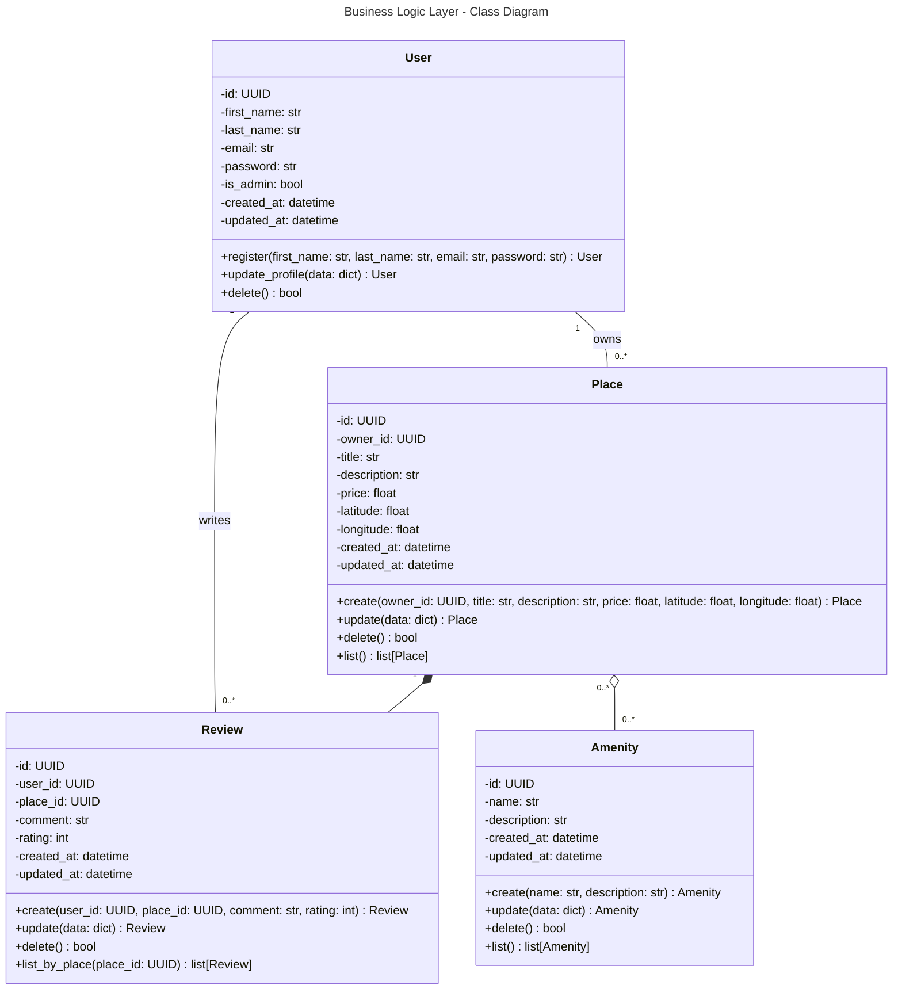

## Relations entre classes

User "1" -- "0..*" Place : possède (1-to-many, Agrégation)  
* Un utilisateur peut posséder plusieurs lieux (Place)

User "1" -- "0..*" Review : écrit (1-to-many, Agrégation)  
* Un utilisateur peut écrire plusieurs avis (Review)

Place "1" *-- "0..*" Review : contient (1-to-many, Composition)  
* Un lieu peut avoir plusieurs avis

Place "0..*" o-- "0..*" Amenity : propose (many-to-many, Association/Agrégation)
* Un lieu peut proposer plusieurs services/commodités (Amenity)
