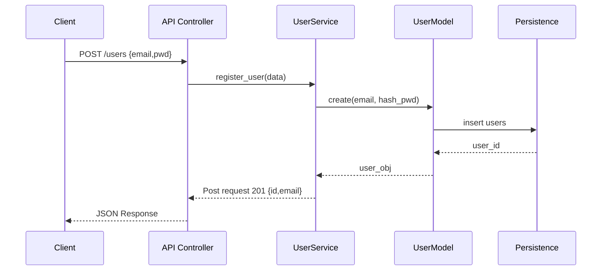
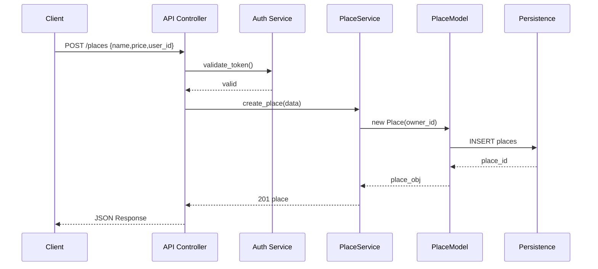
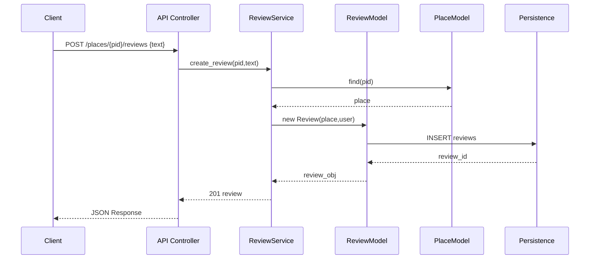
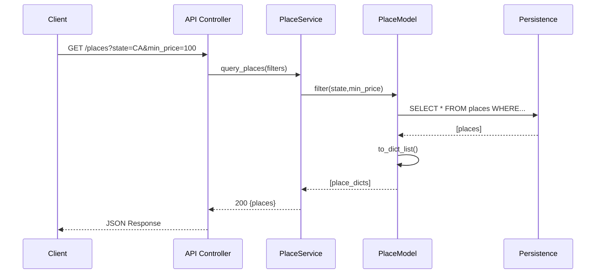

# 2. Sequence Diagrams for API Calls

## 1. User Registration :

### Flux étape par étape :
- Client envoie POST /users {email, mot de passe} vers le contrôleur API
- API valide les données et appelle UserService.register_user()
- UserService hache le mot de passe et appelle UserModel.create(email, hash_pwd)
- UserModel exécute INSERT INTO users dans la couche Persistence
- Base de données renvoie le nouvel user_id en remontant la chaîne
- UserModel construit user_obj et le renvoie à UserService
- UserService renvoie 201 {id, email} (statut Created)
- API envoie la réponse JSON finale au Client

## 2. Place Creation :

### Flux étape par étape :
- Client envoie POST /places {name, price, user_id} vers le contrôleur API
- API appelle Auth Service pour vérifier le Json Web Token
- Auth confirme l'utilisateur (propriétaire valide)
- API appelle PlaceService.create_place(data)
- PlaceService crée PlaceModel avec owner_id = user_id
- PlaceModel exécute INSERT INTO places dans Persistence
- Base de données renvoie le place_id généré
- PlaceModel remonte l'objet complet vers PlaceService
- PlaceService renvoie 201 place_obj à l'API
- API renvoie réponse JSON au Client

## 3. Review Submission :

### Flux étape par étape :
- Client → API: POST /places/{place_id}/reviews {text, user_id}
- API → ReviewService: create_review(place_id, text, user_id)
- ReviewService → PlaceModel: find_by_id(place_id)  # Vérifie place existe
- PlaceModel → DB: SELECT * FROM places WHERE id=?
- DB → PlaceModel → ReviewService: place_obj
- ReviewService → ReviewModel: new Review(place_obj, user_id, text)
- ReviewModel → DB: INSERT INTO reviews (place_id, user_id, text)
- DB → ReviewModel: review_id généré
- ReviewModel → ReviewService: review_obj complet
- ReviewService → API: 201 {id, text, place_id}
- API → Client: JSON réponse

## 4. Fetching a List of Places :

### Flux étape par étape :
- Client → API: GET /places?state=CA&price_min=100
- API → PlaceService: query_places(filters={state:'CA', price_min:100})
- PlaceService → PlaceModel: filter_places(filters)
- PlaceModel → DB: SELECT * FROM places WHERE state=? AND price>=?
- DB → PlaceModel: [raw_places]
- PlaceModel → PlaceModel: [to_dict(place) for place in raw_places]
- PlaceModel → PlaceService: [place_dicts]
- PlaceService → API: 200 {places: [place_dicts], count: N}
- API → Client: JSON réponse paginée
