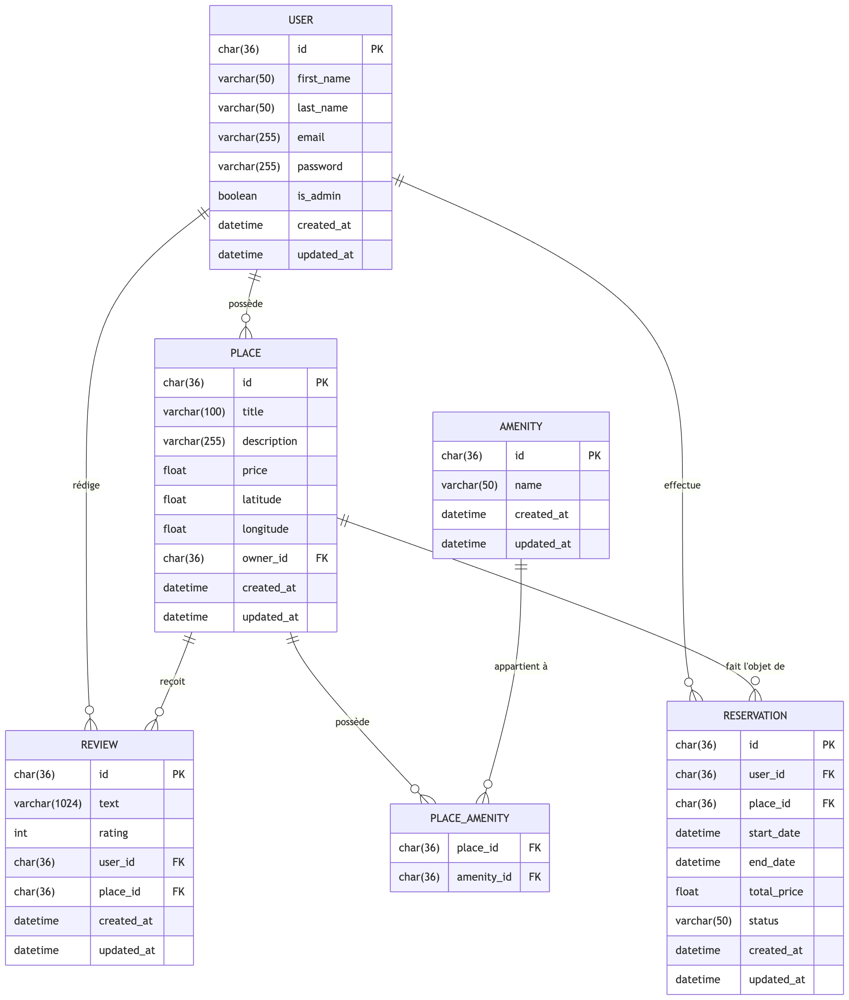
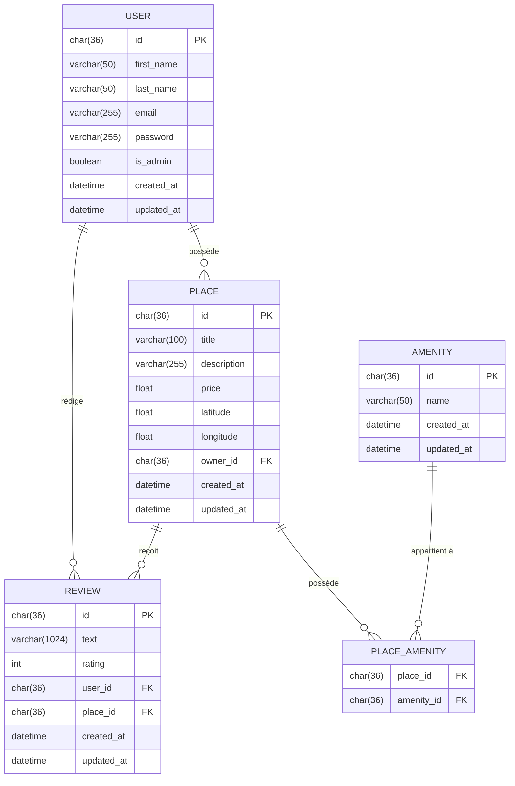
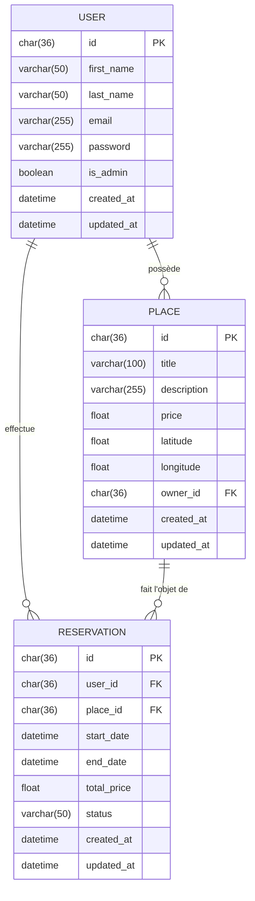

# HBnB Evolution - Part 3: Database & Authentication

## 1. Présentation du Projet

Ce projet est la troisième étape de l'application HBnB. Il implémente :
- L'authentification JWT
- La persistance des données avec SQLAlchemy
- Le contrôle d'accès basé sur les rôles (RBAC)
- Les diagrammes ER de la base de données

## 2. Architecture

L'application est structurée comme suit :

- **Modèles (Models)** : Définissent les entités (User, Place, Review, Amenity) mappées avec SQLAlchemy.
- **Services (Facade)** : Orchestrent les opérations entre l'API et la persistance.
- **API (v1)** : Endpoints Flask-RESTx protégés par JWT.
- **Persistance** : SQLAlchemyRepository avec base de données SQLite.
```
project/
├── app/
│   ├── api/v1/
│   │   ├── auth.py
│   │   ├── users.py
│   │   ├── places.py
│   │   ├── reviews.py
│   │   └── amenities.py
│   ├── models/
│   │   ├── basemodel.py
│   │   ├── user.py
│   │   ├── place.py
│   │   ├── review.py
│   │   └── amenity.py
│   ├── persistence/
│   │   ├── repository.py
│   │   └── user_repository.py
│   └── services/
│       └── facade.py
├── config.py
├── run.py
└── requirements.txt
```

## 3. Installation et Lancement

1. Installer les dépendances :
```bash
pip install -r requirements.txt
```

2. Initialiser la base de données :
```bash
flask shell
>>> from app import db
>>> db.create_all()
>>> exit()
```

3. Lancer le serveur :
```bash
python3 run.py
```

4. Accéder à la documentation Swagger : `http://127.0.0.1:5000/api/v1/`

## 4. Base de Données — Diagramme ER

### Diagramme Principal




### Relations

| Entité A | Entité B | Type | Description |
|----------|----------|------|-------------|
| USER | PLACE | 1:N | Un utilisateur peut posséder plusieurs logements |
| USER | REVIEW | 1:N | Un utilisateur peut rédiger plusieurs avis |
| PLACE | REVIEW | 1:N | Un logement peut recevoir plusieurs avis |
| PLACE | AMENITY | N:N | Relation gérée via PLACE_AMENITY |
| USER + PLACE | REVIEW | UNIQUE | Un seul avis par utilisateur par logement |

### Diagramme Étendu — Avec Réservation


## 5. Authentification JWT

### Login
```bash
curl -X POST "http://127.0.0.1:5000/api/v1/auth/login" \
  -H "Content-Type: application/json" \
  -d '{"email": "admin@hbnb.io", "password": "admin1234"}'
```

Réponse :
```json
{"access_token": "eyJ..."}
```

### Utiliser le token
```bash
curl -X GET "http://127.0.0.1:5000/api/v1/users/" \
  -H "Authorization: Bearer <token>"
```

## 6. Tests

### Tests automatisés
```bash
python3 -m unittest test_endpoints.py -v
```

### Tests manuels — Exemples

**Création d'un utilisateur (admin requis) :**
```bash
curl -X POST "http://127.0.0.1:5000/api/v1/users/" \
  -H "Content-Type: application/json" \
  -H "Authorization: Bearer <admin_token>" \
  -d '{"first_name": "Bob", "last_name": "Sponge", "email": "bob@example.com", "password": "password123"}'
```

**Email invalide → 400 :**
```json
{"error": "Invalid email format."}
```

**Prix négatif → 400 :**
```json
{"error": "Price must be positive."}
```

**Action non autorisée → 403 :**
```json
{"error": "Unauthorized action"}
```