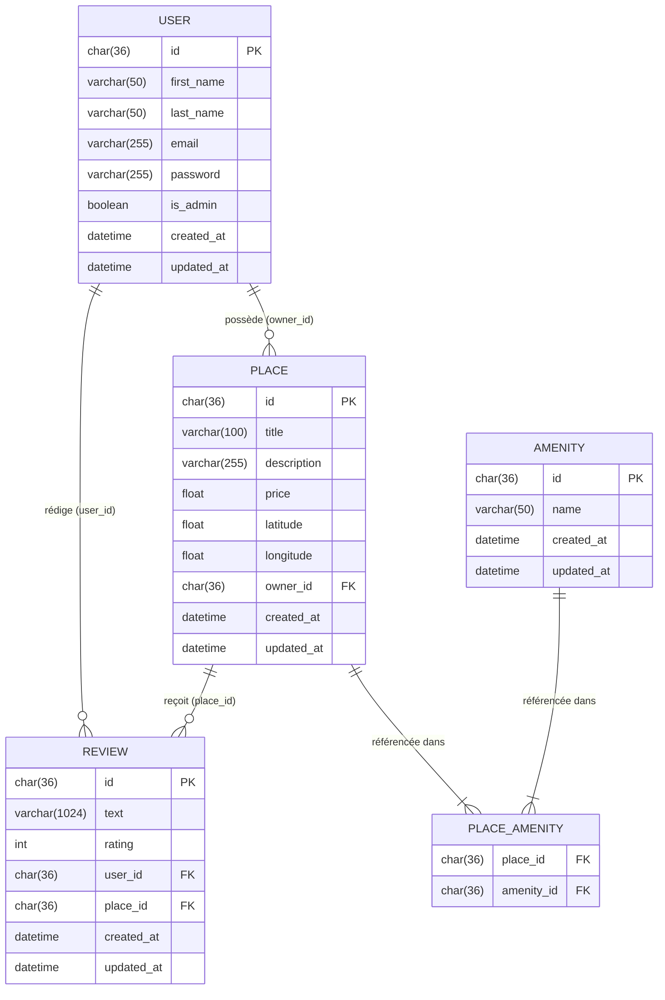
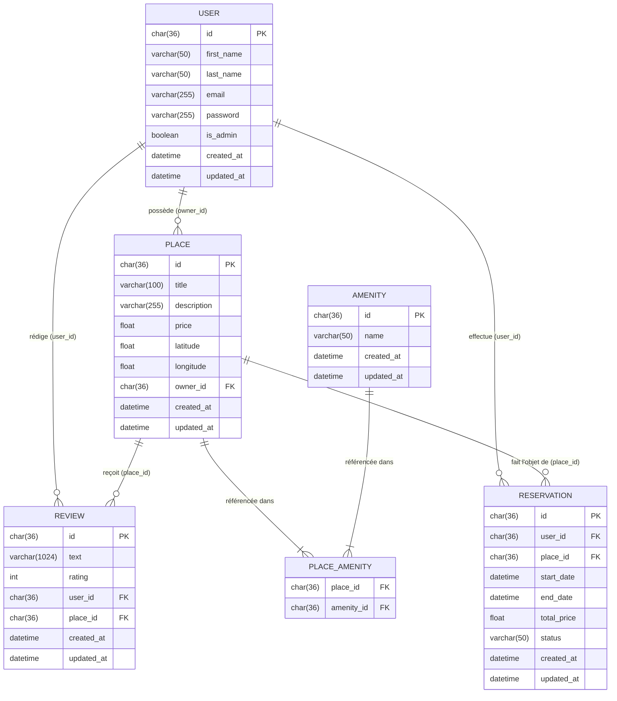

# HBnB - Diagrammes Entité-Relation

## Diagramme Principal

### Résumé des Relations

| Entité A | Entité B     | Type   | Notation   | Clé FK                        | Description                                                                 |
|----------|--------------|--------|------------|-------------------------------|-----------------------------------------------------------------------------|
| USER     | PLACE        | 1:0..N | `\|\|--o{` | `places.owner_id → users.id`  | Un user peut posséder zéro ou plusieurs logements.                          |
| USER     | REVIEW       | 1:0..N | `\|\|--o{` | `reviews.user_id → users.id`  | Un user peut rédiger zéro ou plusieurs avis.                                |
| PLACE    | REVIEW       | 1:0..N | `\|\|--o{` | `reviews.place_id → places.id`| Un logement peut recevoir zéro ou plusieurs avis.                           |
| PLACE    | PLACE_AMENITY| 1:1..N | `\|\|--|{` | `place_amenity.place_id`      | Un logement référencé dans la table d'association a au moins une entrée.    |
| AMENITY  | PLACE_AMENITY| 1:1..N | `\|\|--|{` | `place_amenity.amenity_id`    | Un équipement référencé dans la table d'association a au moins une entrée.  |
| USER + PLACE | REVIEW  | UNIQUE | —          | UNIQUE(user_id, place_id)     | Un user ne peut laisser qu'un seul avis par logement.                       |

---

## Diagramme Étendu — Avec Réservation

### Résumé des Relations

| Entité A     | Entité B      | Type   | Notation   | Clé FK                              | Description                                                               |
|--------------|---------------|--------|------------|-------------------------------------|---------------------------------------------------------------------------|
| USER         | PLACE         | 1:0..N | `\|\|--o{` | `places.owner_id → users.id`        | Un user peut posséder zéro ou plusieurs logements.                        |
| USER         | REVIEW        | 1:0..N | `\|\|--o{` | `reviews.user_id → users.id`        | Un user peut rédiger zéro ou plusieurs avis.                              |
| PLACE        | REVIEW        | 1:0..N | `\|\|--o{` | `reviews.place_id → places.id`      | Un logement peut recevoir zéro ou plusieurs avis.                         |
| PLACE        | PLACE_AMENITY | 1:1..N | `\|\|--|{` | `place_amenity.place_id`            | Un logement référencé dans la table d'association a au moins une entrée.  |
| AMENITY      | PLACE_AMENITY | 1:1..N | `\|\|--|{` | `place_amenity.amenity_id`          | Un équipement référencé dans la table d'association a au moins une entrée.|
| USER + PLACE | REVIEW        | UNIQUE | —          | UNIQUE(user_id, place_id)           | Un user ne peut laisser qu'un seul avis par logement.                     |
| USER         | RESERVATION   | 1:0..N | `\|\|--o{` | `reservations.user_id → users.id`   | Un user peut effectuer zéro ou plusieurs réservations.                    |
| PLACE        | RESERVATION   | 1:0..N | `\|\|--o{` | `reservations.place_id → places.id` | Un logement peut faire l'objet de zéro ou plusieurs réservations.         |
