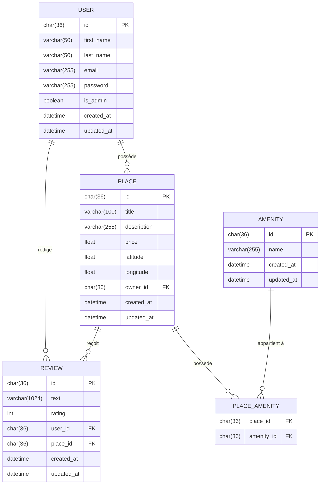
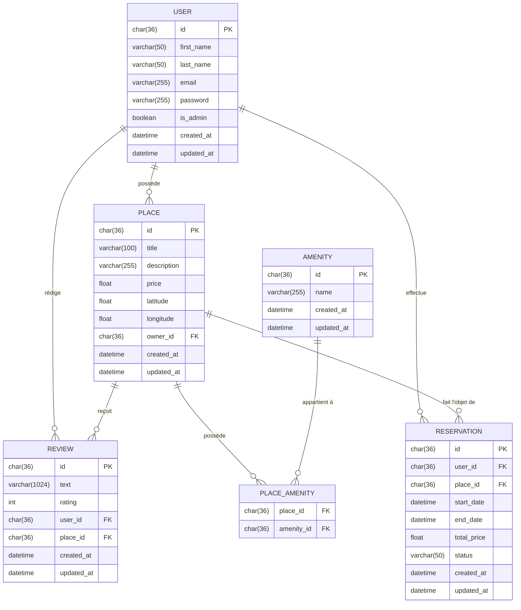

# HBnB - Diagrammes Entité-Relation

## Diagramme Principal

### Résumé des Relations

| Entité A | Entité B | Type | Description |
|----------|----------|------|-------------|
| USER | PLACE | 1:N | Un utilisateur peut posséder plusieurs logements. Chaque logement appartient à un seul propriétaire (`owner_id` FK). |
| USER | REVIEW | 1:N | Un utilisateur peut rédiger plusieurs avis. Chaque avis est rédigé par un seul utilisateur (`user_id` FK). |
| PLACE | REVIEW | 1:N | Un logement peut recevoir plusieurs avis. Chaque avis concerne un seul logement (`place_id` FK). |
| PLACE | AMENITY | N:N | Un logement peut avoir plusieurs équipements et un équipement peut appartenir à plusieurs logements. Relation gérée via la table `PLACE_AMENITY`. |
| USER + PLACE | REVIEW | UNIQUE | Un utilisateur ne peut laisser qu'un seul avis par logement (contrainte UNIQUE sur `user_id` + `place_id`). |

---

## Diagramme Étendu — Avec Réservation

### Résumé des Relations

| Entité A | Entité B | Type | Description |
|----------|----------|------|-------------|
| USER | PLACE | 1:N | Un utilisateur peut posséder plusieurs logements. Chaque logement appartient à un seul propriétaire (`owner_id` FK). |
| USER | REVIEW | 1:N | Un utilisateur peut rédiger plusieurs avis. Chaque avis est rédigé par un seul utilisateur (`user_id` FK). |
| PLACE | REVIEW | 1:N | Un logement peut recevoir plusieurs avis. Chaque avis concerne un seul logement (`place_id` FK). |
| PLACE | AMENITY | N:N | Un logement peut avoir plusieurs équipements et un équipement peut appartenir à plusieurs logements. Relation gérée via la table `PLACE_AMENITY`. |
| USER + PLACE | REVIEW | UNIQUE | Un utilisateur ne peut laisser qu'un seul avis par logement (contrainte UNIQUE sur `user_id` + `place_id`). |
| USER | RESERVATION | 1:N | Un utilisateur peut effectuer plusieurs réservations. Chaque réservation est liée à un seul utilisateur (`user_id` FK). |
| PLACE | RESERVATION | 1:N | Un logement peut faire l'objet de plusieurs réservations. Chaque réservation concerne un seul logement (`place_id` FK). |